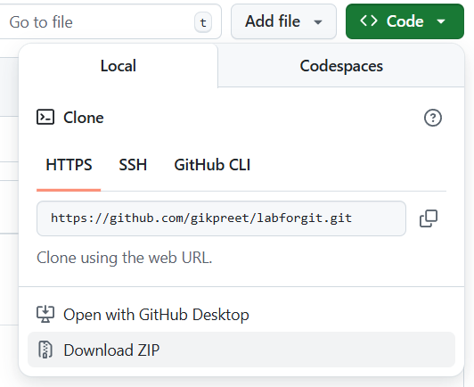

= Clone

Clone은 원격 저장소(GitHub 등)에 있는 프로젝트를 내 컴퓨터(로컬)로 **복제**해오는 명령입니다. 단순히 파일만 다운로드 하는 것이 아니라, 프로젝트의 **모든 히스토리**와 설정까지 모두 가져옵니다. 

Clone은 clone 명령으로 수행할 수 있습니다.

----
git clone [repostory_url]
----

== clone의 동작

GitHub 웹 사이트에는 'Download.ZIP' 이라는 버튼도 있습니다. 이는 `git clone` 과 다릅니다.

* **Download ZIP**: 현재 시점의 파일들만 압축해서 받습니다. 과거 기록이 없고, Git 기능(커밋, 푸시 등)을 사용할 수 없습니다.
* **git clone**: 
1. 최신 파일을 가져옵니다.
2. 과거의 모든 커밋 내역(`.git` 폴더)을 가져옵니다.
3. 원격 저장소 주소를 origin 이라는 이름으로 자동 등록 합니다.
4. 기본 브랜치(main)를 자동으로 선택(Checkout) 해 둡니다.

즉, clone 이 완료되면 별도의 설정(git init, git remote add) 없이 **즉시 작업을 시작하고 push 할 수 있는 상태**가 됩니다.

== 기본 명령어 사용법

터미널에서 사용은 아주 간단합니다.

----
git bach [repository_url]
----

아래 명령을 실행하면, 현재 폴더 안에 my-project라는 폴더가 새로 생기고, 그 안에 파일들이 받아집니다.

----
git clone https://github.com/my-account/my-project.git
----

폴더 이름을 바꾸고 싶다면, 명렁에서 URL 뒤에 원하는 폴더 이름을 지정할 수 있습니다.

----
git clone https://github.com/my-account/my-project.git new-folder-name
----

== 주의사항: 중첩 Clone 금지

Git으로 이미 관리되고 있는 폴더(`.git` 폴더가 있는 곳) 안에서 또 `git clone` 을 하면 안됩니다.

* 잘못된 예
+ 
`C:\Projects\MyWork` (이미 Git 저장소가 위치하는 폴더) 폴더 안에서 -> `git clone ...` 실행 -> `C:\Projects\MyWork\NewProject` (내부 저장소)

이렇게 되면 **'Git 안에 Git'**이 들어가는 꼴이 되어, 외부 폴더가 내부 폴더의 변경 사항을 제대로 추적하지 못하는 오류(Submodule 취급 등)가 발생합니다.

항상 Git이 없는 깨끗한 상위 폴더(예: C:\Git_Repositories)에서 clone을 실행해야 합니다.