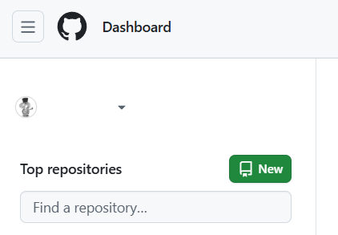
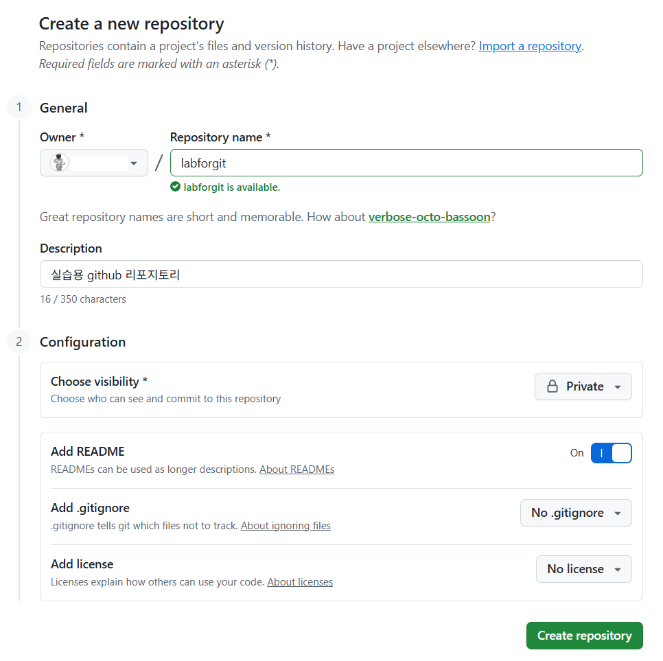
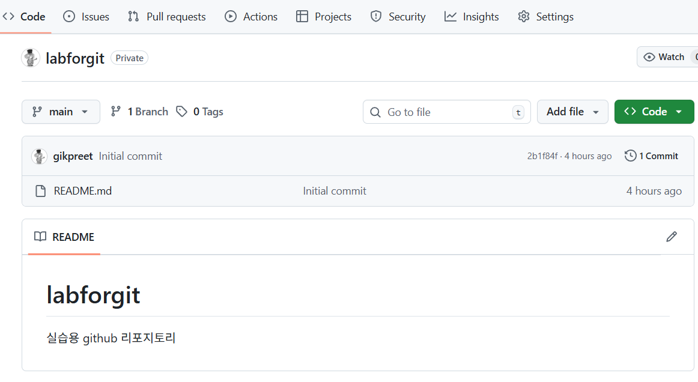
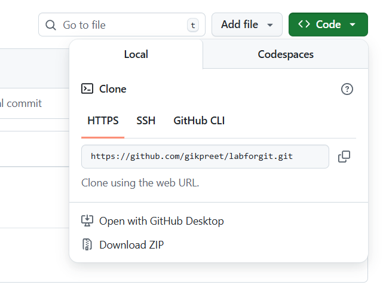

= Lab 1: Git에 저장소 생성
:toc:

이 연습에서는 Git을 통해 버전을 관리할 리포지토리를 생성합니다. 리포지토리로 Github을 사용합니다. 아래 절차에 따릅니다.

== 연습 1: 환경 설정

이 연습에서는 기본 Git 환경을 설정합니다.

1. 터미널을 엽니다.
2. 아래 명령을 실행하여 설치된 Git 버전을 확인합니다.
+
----
git --version
----
3. 아래 명령을 실행하여 Git 계정 이름과 게정 생성시 등록한 email을 등록합니다.
+
----
git config --global user.name [name]
git config --global user.email [email address]
----
4. 아래 명령을 실행하여 기본 Git 에디터를 Visual Studio Code로 지정합니다.
+
----
git config --global core.editor code --wait
----
5. 아래 명령을 실행하여 서식 및 호환성을 운영체제에 맞도록 지정합니다.

* Windows의 경우
+
----
git config --global core.autocrlf true
----
* macOS / Linux의 경우
+
----
git config --global core.autocrlf input
----
6. 아래 명령을 실행하여 설정을 확인합니다.
+
----
$ git config --global --list
user.name=gikpreet
user.email=gik_kim@hotmail.com
core.editor=code
core.autocrlf=true
----

== 연습 2: Git Repository 생성

1. 웹 브라우저를 열고, Github으로 이동합니다.
+
https://github.com/

2. 로그인 상태로 표시되지 않는다면, 로그인합니다.
3. Dashboard 에서, **New** 버튼을 클릭합니다.
+

4. **Create a new repository** 페이지에서, **Repository name**에 _labforgit_ 이라고 입력합니다.
5. **Description**에 _실습용 github 리포지토리_ 라고 입력합니다.
6. **Configuration** 구역의 **Choose visibility**를 _Private_ 으로 지정합니다.
7. **Add READNE** 옵션을 _On_ 으로 지정합니다.
8. **Create repository** 버튼을 클릭합니다.
+

9. 생성된 리포지토리를 확인합니다.
+

== 연습 3: 터미널에서 clone 명령을 사용하여 로컬 저장소로 복제

여기에서는 git clone 명령을 사용하여 원격 저장소(Github) 리포지토리를 로컬 리포지토리로 복사합니다. 아래 절차에 따릅니다.

1. 생성된 리포지토리에서, 녹색 **Code** 버튼을 클릭하고 **Local** 탭의 **Clone** 구역에서 **HTTPS** 항목을 복사합니다.
+

2. 터미널을 실행합니다.
3. 다음 명령을 실행하여 local_repository 폴더를 생성하고 생성된 폴더로 이동합니다.
+
----
$ mkdir local_repository
$ cd local_repository
----
4. 아래 명령을 실행하여 GitHub 원격 리포지토리를 clone 합니다.
+
----
git clone https://github.com/gikpreet/labforgit.git
----
5. 아래 명령을 실행하여 clone 된 디렉토리를 확인합니다.
+
macOS / Linux 에서
+
----
$ ls ./labforgit
README.md
----
+
windows에서
+
----
> dir .\labforgit
2024-12-04  오후 03:19    <DIR>          .
2024-12-04  오후 03:19    <DIR>          ..
2025-12-04  오후 03:19                47 README.md
----

